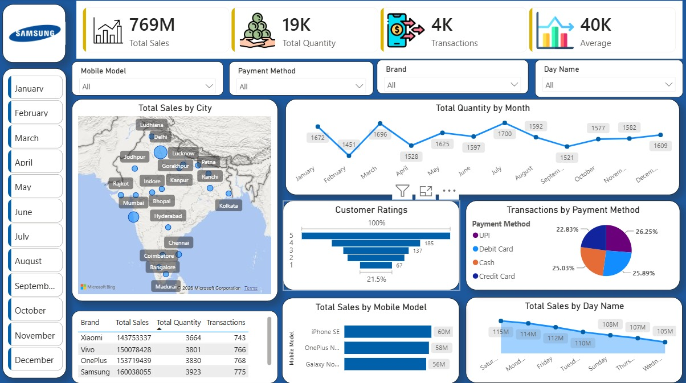

# 📱 Mobile Sales Analysis Dashboard

## 📌 Overview
This project is an interactive Power BI dashboard created to analyze mobile sales performance using an Excel dataset. It provides business insights through KPIs, charts, maps, and interactive filters.

## 📊 Key KPIs
- Total Sales: 769M
- Total Quantity: 19K
- Total Transactions: 4K
- Average Sales: 40K

## 📈 Dashboard Features
- Sales by City (Map)
- Monthly Sales Trend
- Customer Ratings Analysis
- Transactions by Payment Method
- Sales by Mobile Model
- Sales by Day Name
- Brand-wise Sales Analysis
- Interactive Filters (Month, Brand, Mobile Model, Payment Method)

## 🛠️ Tools Used
- Power BI
- Microsoft Excel
- Power Query
- DAX

## 🖼️ Dashboard Preview

## 📂 Files Included
- power bi project.pbix
- Mobile_Sales_Data.xlsx
- Dashboard Image

## 👨‍💻 Author
Mohammed Aman Khan
